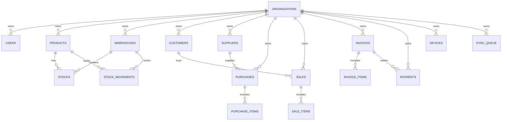

# SwiftLab Database Specification & Entity Reference

## 1. Dual-Database Strategy

SwiftLab uses two database engines depending on the deployment profile:
- **Local Embedded Mode (Profile: `local` / Desktop):**
  - Engine: H2 Database Engine 2.2+
  - Storage: File-based persistence at `./data/invoicedb.mv.db`
  - URL: `jdbc:h2:file:./data/invoicedb;DB_CLOSE_DELAY=-1;DB_CLOSE_ON_EXIT=FALSE;AUTO_SERVER=TRUE`
  - Characteristics: Zero installation, fast cold start, survives application crashes and machine reboots.
- **Cloud Central Mode (Profile: `cloud` / Web / Render):**
  - Engine: PostgreSQL 15+ hosted on Supabase
  - URL: `jdbc:postgresql://<host>:5432/<database>`
  - Characteristics: High availability, connection pooling, Row Level Security (RLS), ACID multi-tenant clustering.

---

## 2. Relational Entity Overview

---

## 3. Key Table Definitions & Constraints

### 3.1 Tenancy & Authentication
- `organizations`:
  - Columns: `id` (PK), `name`, `currency`, `country`, `tax_id`, `plan`, `active`, `created_at`, `updated_at`.
- `users`:
  - Columns: `id` (PK), `organization_id` (FK), `username` (UNIQUE), `password` (BCrypt), `full_name`, `email`, `role`, `active`.
  - Roles: `OWNER`, `ADMIN`, `MANAGER`, `STAFF`.
- `api_tokens`:
  - Columns: `id` (PK), `token` (UNIQUE), `user_id` (FK), `organization_id` (FK), `device_id`, `expires_at`, `revoked`.

### 3.2 Catalog & Inventory
- `products`:
  - Constraints: `UNIQUE (organization_id, sku)`.
  - Soft Delete: `deleted` (BOOLEAN), `deleted_at` (TIMESTAMPTZ).
- `stocks`:
  - Constraints: `UNIQUE (organization_id, warehouse_id, product_id)`.
  - Fields: `quantity`, `reserved_quantity`, `updated_at`.
- `stock_movements`:
  - Immutable audit ledger tracking every single change.
  - Fields: `type`, `quantity`, `balance_after`, `reference_type`, `reference_id`, `device_id`, `created_by`, `created_at`.

### 3.3 Sales & Billing
- `sales`:
  - Fields: `sale_number`, `status` (COMPLETED, CANCELLED), `total_amount`, `paid_amount`, `invoice_id`.
  - Items in `sale_items`.
- `invoices`:
  - Fields: `invoice_number`, `status` (DRAFT, PENDING, PARTIALLY_PAID, PAID, OVERDUE, CANCELLED), `subtotal`, `tax_rate`, `tax_amount`, `discount`, `total`, `issue_date`, `due_date`.
- `payments`:
  - Fields: `payment_number`, `amount`, `method` (CASH, UPI, CARD, BANK_TRANSFER, CREDIT, OTHER), `payment_date`, `reference_number`.

### 3.4 Synchronization & Audit
- `sync_queue`:
  - Fields: `device_id`, `entity_type`, `entity_id`, `operation`, `payload`, `status` (PENDING, SYNCING, SYNCED, FAILED), `retry_count`, `error_message`.
- `applied_sync_keys`:
  - Constraint: `sync_key` (UNIQUE) to prevent duplicate processing.
- `audit_logs`:
  - Fields: `organization_id`, `user_id`, `device_id`, `username`, `action`, `entity_type`, `entity_id`, `metadata`, `created_at`.
